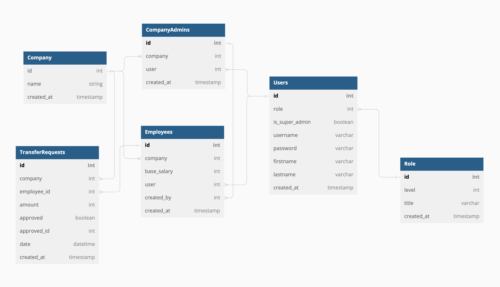

# Salary-Hero Demo Project

---

## Project Develop with

---

1. Node version 16.6.1
2. MacOS M1 Monterey 12.4
3. Docker version 20.10.21

## Project Overview

---

As business requirement which follows

- Salary Hero can C/R/U/D a company.
- Salary Hero can add client admin for a company.
- A client admin can C/R/U/D an employee for **that company**.
- A client admin can import employees for **that company**.
- An employee can request money transfer (sum request amount for that month < 50% base salary.)

This is Database Diagram on this project.



I'm design each action base on **Role** of user which represent for authorization on that user action.

Base on requirement so we have key points ...

- 3 roles on our project.

  - superadmin-role
  - clientadmin-role
  - employee-role

<br >

- 3 main api router with require role for control resources.

  - company,admin resource: /company (require [superadmin-role])
  - employee resource: /company/:companyId/employee (require [superadmin-role, clientadmin-role])
  - transfer resource: /company/:companyId/transfer (require [superadmin-role, employee-role])

<br >

- CompanyAdmin Model and Employee Model to represent as user profile.

<br>

- **Date** field TrasferRequest Model for grouping and sum amount in each month.

<br>

- Summary api authorize (superadmin-role for debuging purpose!.).

  - for company, admin resource only superadmin-role can use.
  - for employee resource only superadmin-role and valid employee in that company can use.
  - for transfer resource only superadmin-role and self employee in that company can use.

  - for role authorization i've create `roleGuard.js` which protect only user role pass condition can use api.
  - for company authorization i've create `companyGuard.js` which protect only user in company can use api.

## Project seed data with seed.js

---

for a convenient testing i've setup mock data in `seed.js` to mockup company, client-admin and some employee and transfer for that mock company.

- roles

  - SUPER_ADMIN
  - CLIENT_ADMIN
  - EMPLOYEE

<br >

- company

  - name: APPLE

<br >

- superadmin

  - username: salaryhero
  - password: salaryhero_123
  - firstname: salaryhero_f
  - lastname: salaryhero_l
  - role: SUPER_ADMIN

<br >

- apple company admin user

  - username: apple_admin1
  - password: apple_admin1_123
  - firstname: apple_admin1_f
  - lastname: apple_admin1_l
  - role: CLIENT_ADMIN
  - company: APPLE

<br >

- apple company employees users.

  - first employee

    - username: apple_employee1
    - password: apple_employee1_123
    - firstname: apple_employee1_f
    - lastname: apple_employee1_l
    - role: EMPLOYEE
    - company: APPLE

  - second employee

    - username: apple_employee2
    - password: apple_employee2_123
    - firstname: apple_employee2_f
    - lastname: apple_employee2_l
    - role: EMPLOYEE
    - company: APPLE

  - third employee

    - username: apple_employee3
    - password: apple_employee3_123
    - firstname: apple_employee3_f
    - lastname: apple_employee3_l
    - role: EMPLOYEE
    - company: APPLE

<br >

- transfer for each employee

  - trasfer 1
    - date: '2022-10-05'
    - amount: 1500
  - trasfer 2
    - date: '2022-10-06'
    - amount: 1500
  - trasfer 3
    - date: '2022-11-05'
    - amount: 2500
  - trasfer 4
    - date: '2022-11-06'
    - amount: 2500
  - trasfer 5
    - date: '2022-12-05'
    - amount: 8000

## How to run application

---

### 1. run full application with docker-compose.app.yml

**setup env**

- open env.example and select env-variable-set `for using docker-compose.app.yml`
- save new file with .env

**step run**

- 1. start with `docker compose -f docker-compose.app.yml up`
- 2. go into server container `docker compose -f docker-compose.app.yml exec server bash`
- 3. run seed data `npx prisma db seed` (run seed data only fresh app.)
- 4. enjoy.

<br >

**this options provide your**

- container run postgres database on port 5432.
- container run server start up on port 3000 (up to your env. default 3000)
- container run prisma studio on port 5555

### 2. run only database and using local server.

**setup env**

- open env.example and select env-variable-set `for using docker-compose.db.yml`
- save new file with .env

**step run**

- 1. start with `docker compose -f docker-compose.db.yml up`
- 2. run migration with `npx prisma migrate deploy`
- 3. run seed data with `npx prisma db seed` (run seed data only fresh app.)
- 5. [optional] run prisma studio (database monitoring) with `npx prisma studio`
- 4. start server with `npm run dev`
- 5. enjoy.

<br >

**this options provide your**

- container run postgres database on local port 5432.
- local server start up on port 3000 (up to your env. default 3000)
- local run prisma studio on port 5555

## API List Description

---

public route

| Method | endpoint | description       |
| ------ | -------- | ----------------- |
| GET:   | /signin  | to get credential |

private routes

| Method  | endpoint                                | description                                        |
| ------- | --------------------------------------- | -------------------------------------------------- |
| GET:    | /me                                     | to show your credential                            |
| GET:    | /company                                | to lists all companies.                            |
| POST:   | /company                                | to create company.                                 |
| GET:    | /company/:companyId                     | to get a company by companyId.                     |
| PUT:    | /company/:companyId                     | to update a company.                               |
| DELETE: | /company/:companyId                     | to delete a company.                               |
| POST:   | /company/:companyId/admin               | to create company admin.                           |
| GET:    | /company/:companyId/employee            | to lists all employee in company.                  |
| POST:   | /company/:companyId/employee            | to create an employee in company.                  |
| PUT:    | /company/:companyId/employee/employeeI  | to update an employee in company.                  |
| DELETE: | /company/:companyId/employee/employeeId | to delete an employee in company.                  |
| POST:   | /company/:companyId/employee/import     | to import employ in company by .csv file.          |
| POST:   | /company/:companyId/transfer            | to createrequest transfer for employee in company. |

## How to testing without postman

---

In every module i've setup api testing with client **REST Client** vscode extension.

    src/
    ├── models/
    ├── middlewares/
    ├── modules/
    |  ├── company/
    |  |  ├── controller/
    |  |  ├── request/ -> here
    |  |  └── service/
    .
    .
    .
    |     ├── controller/
    |     ├── request/
    |     ├── service/
    |     └── utils/
    ├── services/
    └── utils/

in request directory in module are contain file with naming follow `***.request.http` open this file and click send under request (make sure that you are installed **REST Client**).

    signin.request.http

    ```
    ### Signin
    POST http://localhost:3000/signin
    Content-Type: application/json

    {
        "username": "salaryhero",
        "password": "salaryhero_123"
    }
    ```

## Useful command

---

`npx prisma migrate reset`

- for restart app to fresh app using `npx prisma migrate reset` this command do flush your database and run all migration file and seeding data using `seed.js`

## Issue may found

---

1. prisma schema error from os system

- prisma schema generator may raise an error from os system i suggest you set `binaryTargets` in `schema.prisma` by changing binaryTargets that suit your os by default value is native if value not provided.

<br >

please see ref.

- https://www.prisma.io/docs/reference/api-reference/prisma-schema-reference#binarytargets-options

- https://www.prisma.io/docs/concepts/components/prisma-schema/generators

```
generator client {
  provider = "prisma-client-js"
  binaryTargets: native -> default value.
}
```
